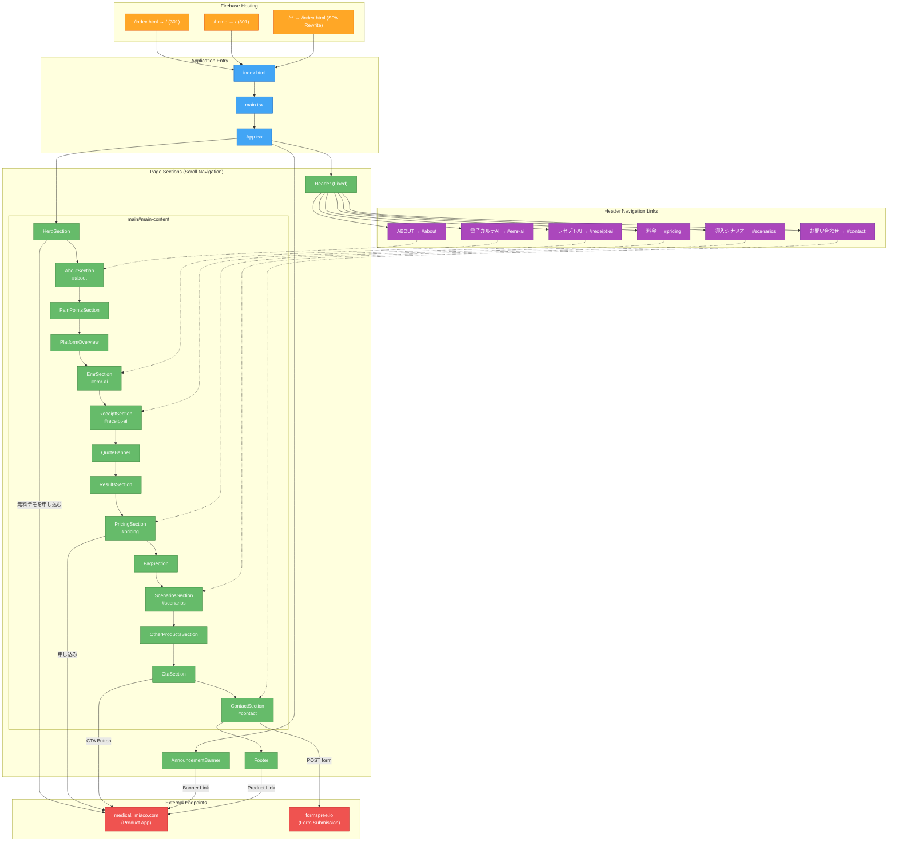

# ILMIA Website — Endpoint Route Flow

ဤပရောဂျက်သည် **Single Page Application (SPA)** ဖြစ်ပြီး React Router ကဲ့သို့ routing library မသုံးပါ။ Navigation အားလုံးကို **anchor links** (`#section-id`) ဖြင့် ဆောင်ရွက်သည်။ Firebase Hosting က SPA rewrite rule ဖြင့် `/**` path အားလုံးကို `index.html` သို့ ပြန်ညွှန်းသည်။

## Route Flow Diagram

## Flow အကျဉ်းချုပ်

### Request Flow
1. User သည် `ilmiaco.com` သို့ ဝင်ရောက်သည်
2. Firebase Hosting က `/index.html` ကို serve လုပ်သည် (SPA rewrite)
3. `/index.html` နှင့် `/home` URLs များကို `/` သို့ 301 redirect လုပ်သည်
4. `index.html` → `main.tsx` → `App.tsx` အစဉ်လိုက် load ဖြစ်သည်

### Page Navigation (Anchor Links)
| Navigation Item | Target Section ID |
|----------------|-------------------|
| 電子カルテAI | `#emr-ai` |
| レセプトAI | `#receipt-ai` |
| 料金 | `#pricing` |
| 導入シナリオ | `#scenarios` |
| ABOUT | `#about` |
| お問い合わせ | `#contact` |

### External Endpoints
| Endpoint | Purpose | Method |
|----------|---------|--------|
| `https://medical.ilmiaco.com` | Product application (demo signup) | Link (GET) |
| `https://formspree.io/f/xgvapkaz` | Contact form submission | POST |

### Static Assets & Special Routes
| Path | Purpose |
|------|---------|
| `/robots.txt` | Search engine crawl rules |
| `/sitemap.xml` | Sitemap for SEO |
| `/manifest.json` | PWA manifest |
| `/.well-known/llms.txt` | LLM discovery |
| `/.well-known/security.txt` | Security contact info |
| `/opensearch.xml` | OpenSearch description |
| `/api-directory.json` | API directory |
| `/knowledge-base.json` | Knowledge base data |
| `/404.html` | Custom 404 page |
